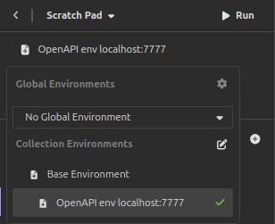

# Projet domotique (nom temporaire)

## Prérequis

- JDK (Java Development Kit) 23 ou plus  
  **Commandes Ubuntu (une ligne = une commande)** 
  ```bash
  wget -qO - https://packages.adoptium.net/artifactory/api/gpg/key/public | sudo gpg --dearmor | sudo tee /etc/apt/trusted.gpg.d/adoptium.gpg > /dev/null
  echo "deb https://packages.adoptium.net/artifactory/deb $(awk -F= '/^VERSION_CODENAME/{print$2}' /etc/os-release) main" | sudo tee /etc/apt/sources.list.d/adoptium.list
  sudo apt update && sudo apt install -y temurin-23-jdk
  ```
  **Windows** : [Télécharger le JDK Temurin 23](https://adoptium.net/fr/temurin/releases/?version=23&os=windows&arch=x64)
- MySQL 8.0 ou plus

## Première configuration

1. Cloner le dépôt dans un dossier au choix et s'y rendre  
   **Terminal (Linux & Windows) :**
   ```bash
   git clone https://github.com/ChuechTeam/Domotique.git
   cd Domotique
   ```
   **IntelliJ :** File > New > Project from Version Control > GitHub
2. Télécharger toutes les dépendances du projet   
   **Terminal (Linux) :** `./gradlew build`     
   **Terminal (Windows) :** `gradlew.bat build`    
   **IntelliJ :** Onglet Gradle > Sync All Gradle Projects
3. Mettre l'utilisateur et le mot de passe MySQL dans le fichier de configuration
   `src/main/java/resources/config-dev-local.properties`
4. Initialiser la base de données   
   **Terminal (Linux) :** `./gradlew updateDatabase` ou `./liquibase`     
   **Terminal (Windows) :** `gradlew.bat build` ou `./liquibase.bat`    
   **IntelliJ :** Onglet Gradle > Sync All Gradle Projects
5. Lancer l'application !  
   **Terminal (Linux) :** `./gradlew run`    
   **Terminal (Windows) :** `gradlew.bat run`    
   **IntelliJ :** Bouton Run (flèche verte) 'Run project'

## Comment tester le backend ?

Recommandation : utiliser l'application [Insomnia](https://insomnia.rest/download) puis importer le fichier OpenAPI `src/main/resources/openapi.yml`.

- Cliquer sur "Continue"
- Cliquer sur "Use a local scratch pad"
- Cliquer sur "Scratch pad" > "Import"
- Choisir le fichier `src/main/resources/openapi.yml` puis "Import"
- Choisir l'environement localhost   
  
- Lancer une requête au choix

## Documentation supplémentaire

Voir le dossier `docs/` du projet :

| Documentation                                              | Description                                                           |
|------------------------------------------------------------|-----------------------------------------------------------------------|
| **[Architecture](docs/ARCHITECTURE.md)**                   | Description de l'architecture du projet                               |
| **[Cookbook Vert.x Future](docs/COOKBOOK_VertxFuture.md)** | Feuille pratique pour `Future<T>` de Vert.x                           |
| **[Cookbook Templates](docs/COOKBOOK_Templates.md)**       | Feuille pratique pour écrire des templates JTE (Java Template Engine) |
| **[Help](docs/HELP.md)**                                   | Liens un peu au pif de documentation                                  |
